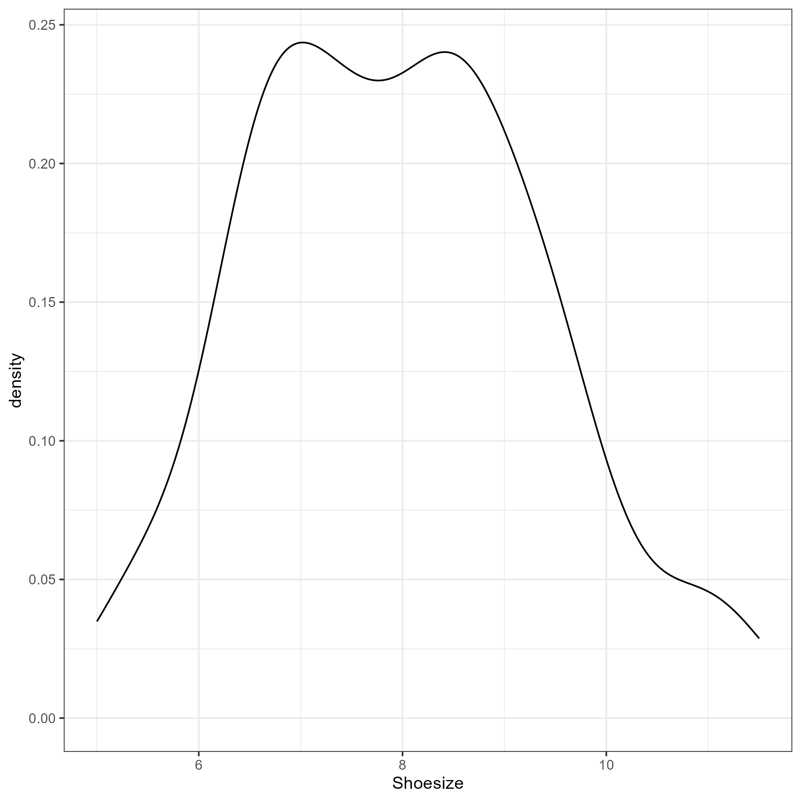

```{r load_packages, include = FALSE}
library("papaja")
#bibliography      : ["r-references.bib"]
library(worcs)
run_everything = FALSE
```

Latent class analysis (LCA) is an umbrella term that refers to a number
of techniques for estimating unobserved group membership based on a
parametric model of one or more observed indicators of group membership.
The types of LCA have become quite popular across scientific fields,
most notably finite Gaussian mixture modeling and latent profile
analysis. @vermunt_latent_2004 defined LCA more generally as
virtually any statistical model where "some of the parameters [...]
differ across unobserved subgroups".

Despite its popularity, there is a lack of standards for estimating and
reporting LCA. While @van_de_schoot_grolts-checklist_2017 developed
reporting guidelines for a specific type of LCA known as latent growth
models, general reporting guidelines for best practices in LCA are still
lacking.
This introduces a risk of misapplications of the technique,
and complicates manuscript review and assessment of the quality of published studies.
The present paper seeks to address this gap in the literature by introducing updated guidelines for estimation and reporting on latent class analysis,
based on current best practice. 
Importantly, in order to lower the barrier of entry to latent class analysis
and ensure reproducibility of all examples,
this paper exclusively uses free, open source software for latent class analysis in R.
To this end, new functionality was developed in the R-package `tidySEM` [REF tidysem].

## Defining Latent Class Analysis

Latent class analysis is a group of methods for estimating unobserved
groups based on a parametric model of observed indicators of group
membership. The concept of LCA can be understood in different ways. A
mixture model assumes that the study population is composed of $K$
subpopulations or classes.
It further assumes that the observed data are
a mixture of data originating from those subpopulations;
hence the name mixture model.
Consider the simplest possible
univariate "model", which is a normal distribution.
This model has
two parameters: the mean and the variance.
Latent class analysis aims to estimate the values of those parameters across a known number of classes $k$,
as well as the probability of belonging to classes $1 \ldots k$ for every individual $i$.
Commonly, the same model is estimated across all classes,
but with different parameters for each class (i.e., class-specific means and variances).
From this perspective, reporting the mean and variance of a variable is a special case of a mixture model with $k = 1$ class.

As an illustrative example, imagine that a detective wants to know if it
would be possible to use mixture modeling to identify the sex of a
suspect, based on footprints found at the crime scene. To test the
feasibility of this approach, the detective records the shoe sizes and
sex of 100 volunteers. The resulting observed data look like this:

```{r echo = FALSE}
library(tidySEM)
library(ggplot2)
set.seed(1)
n = 100
C <- sample(c("Man", "Woman"), n, replace = TRUE)
means <- c(Man = 9, Woman = 7)
X <- rnorm(n, mean = means[C], sd = 1)
X <- round(X*2)/2
obsparam <- tapply(X, C, mean)
shoesize_shapiro <- shapiro.test(X) # Shapiro-Wilk test of normality
```

```{r echo = FALSE, eval = run_everything}
est <- mx_profiles(data.frame(X), 2)
estparam <- table_results(est, c("label", "est", "matrix"))
estparam <- as.numeric(estparam$est[estparam$matrix == "M"])
props <- class_prob(est, "individual")$individual[ , "predicted"]
dput(props, "props.txt")
dput(estparam, "estparam.txt")

p <- ggplot(data.frame(Shoesize = X), aes(x = Shoesize)) + geom_density() + theme_bw()
ggsave("shoedens.png", p, device = "png")
```

```{r shoedens, echo = FALSE, fig.cap="Kernel density plot of shoe sizes."}
props <- eval(parse("props.txt"))
estparam <- eval(parse("estparam.txt"))

```

The distribution is evidently bimodal, which bodes well for the intended
mixture model. In this case, the number of classes is known a-priori.
When estimating a two-class mixture model, the detective observes that
the model estimates the mean shoe size of the two groups are equal to
`r report(estparam[1], equals = FALSE)` and
`r report(estparam[2], equals = FALSE)`, which is close to the true
means of the two groups, namely `r report(obsparam[1], equals = FALSE)`
and `r report(obsparam[2], equals = FALSE)`. When tabulating estimated
group membership against observed (known) group membership, it can be
seen that women are classified with a high degree of accuracy, but men
are not:

```{r tabshoe, results="asis"}
library(kableExtra)
tab <- table(C, props)
tab <- data.frame(Observed = rownames(tab), as.data.frame.array(tab))
names(tab)[2:3] <- c("Class 1", "Class 2")
rownames(tab) <- NULL
kbl(tab, caption = "Observed group membership by estimated class membership.")
```

Another way to conceptualize latent class analysis is by analogy to a measurement model in structural equation modeling.
A mixture model is like confirmatory factor analysis,
except that the continuous latent variable is substituted with a categorical latent variable.
One difference between
the two techniques is that factor analysis can be considered as a way to
group observed *variables* into latent constructs, and LCA groups
*individuals* into classes. While factor analysis seeks to describe the
relations between variables, LCA seeks to describe each unobserved group
and the differences between them. In line with this distinction, LCA
(mixture models) is referred to as a "person-centered" technique, and
factor analysis as a "variable-centered" technique
[@nylund-gibson_ten_2018; @masyn_latent_2013].

When the focus is on the model parameters in each group, LCA can be
thought of as similar to a multi-group structural equation model. The
main distinction is that group membership is not known a-priori, but is
instead estimated -- with measurement error -- based on the data.
Whereas in a multi-group model, the data are split by group and treated
as independent samples, in LCA, all cases contribute to the estimation
of all parameters in all groups. The relative contribution of each case
to the parameters of each group is determined by that case's posterior
probability of belonging to that group.

In factor analysis, the latent variable is continuous, so the relationships
between indicators are defined by the communalities between them. Here, the
latent variable represents the error corrected approximation of the
sample. In LCA, by contrast, the relation between indicators is defined by how
well they separate the classes, as a multinomial regression between the
indicators and the latent variable [@masyn_latent_2013].

When the focus is on each individual's estimated class membership,
LCA can be thought of as a type of clustering algorithm that corrects for (random) measurement error.
Specifically, the posterior class probability that an individual belongs to a latent class
can be computed from the likelihood of that individual's observed data under given the class-specific model.
These posterior class probabilities can be used to weight follow-up analyses,
or individuals can be assigned to classes based on their highest class probability.
If the classes are clearly distinct, measurement error is low, and the latter approach is probably acceptable.
This perspective on mixture modeling is sometimes referred to as "model-based
clustering" [@hennig_handbook_2015; @scrucca_mclust_2016]. 
Many clustering algorithms apply some recursive splitting algorithm to the data. By
contrast "model-based" clustering refers to the fact that LCA estimates
cluster membership based on a parametric model.
Since a parametric model estimates only a fixed number of parameters,
it can be a relatively parsimonious solution compared to non-parametric techniques.

Finally, in the context of machine learning, LCA can be considered as an
*unsupervised classification* method [@figueiredo_unsupervised_2002].
The term *unsupervised* refers to the fact that the outcome variable --
true class membership -- is not known, and the term *classification*
refers to the fact that the algorithm is predicting a categorical
outcome -- class membership.

## A Taxonomy of Latent Class Analysis Methods

In this paper, we use the term latent class analysis to refer to a
family of techniques that estimate latent class membership based on a
parametric model of observed indicators. From a historical perspective,
the term was initially conceived to refer to analyses with categorical,
usually binary indicators [@vermunt_latent_2004]. Nowadays, there are
a number of related techniques, known by distinct names, that serve a
similar purpose. The term "latent class analysis" seems most appropriate
as an umbrella term for this broader class of models, as it only refers
to the purpose of the analysis, and does not imply restrictions to the
model used, or the level of measurement of the indicators. Given the
abundance of terms in use for closely related classes of models, we will
provide a rudimentary taxonomy of LCA methods.

A common type of LCA is the *finite Gaussian mixture model*; a
univariate analysis where the observed distribution of a single variable
is assumed to result from a mixture of a known number of normal
(Gaussian) distributions. The parameters of a finite Gaussian mixture
model are the means and variances of these underlying normal
distributions. The analysis of shoe sizes presented earlier is a
canonical example of this type of analysis. In the multivariate case,
with more than one indicator variable, the parameters of a mixture model
are the means, variances, and covariances between the indicators (which
can be standardized to obtain correlations). These parameters can be estimated 
freely, or set to be constrained across classes [@collins_latent_2009].

The technique known as *latent profile analysis (LPA)* is a special case
of the mixture model, which assumes conditional independence of the
indicators. Conditional independence means that, after class membership
is accounted for,
the residual covariances/correlations between indicators are
assumed to be zero.
In some cases, such constraints
will be inappropriate; for instance when the cohesion between indicators
is expected to differ between classes [@collins_latent_2009].
Consider, for example, a mixture model of ocean plastic particles, which found two classes of particles based on length and width:
A class of larger particles with a low correlation between length and width,
and a class of smaller particles with a high correlation between length and width.
The reason for this difference in correlations makes theoretical sense:
the large particles were heterogenous in shape,
whereas the smaller particles had been polished to a more uniform (rounded) shape by the elements [@alkema_maximizing_2022].

It is also possible to estimate a mixture model based on latent
indicators. This means that, within each class, one or more continuous
latent variables are estimated based on the observed indicators.
Categorical latent variable membership is then estimated based on these
continuous latent variables. A common application of this approach is in
longitudinal research, where the indicators reflect one construct
assessed at different time points. Examples of this approach include
*growth mixture models* (GMM) and *latent class growth analyses* (LCGA) 
[@jung_introduction_2008]. These techniques estimate a latent growth model 
to describe grouped trajectories over time. The growth mixture model is a 
latent class model where the parameters that indicate class membership are the 
intercepts and variances, and typically covariances of the latent growth 
variables, e.g., a latent intercept and slope. This technique assumes that
individuals within a class can have heterogenous trajectories. If the
variance of the growth parameters is fixed to zero, it is known as a
latent class growth analysis. This latter approach assumes that all
individuals within a class share the same identical trajectory, and that
any variance in the indicators not explained by the class-specific
latent trajectories is due to residual error variance.

The term latent class analysis originally referred to cases where the
observed indicators were ordinal [@collins_latent_2009]. 
Nowadays, it is more commonly used
as an umbrella term. To prevent ambiguity, the special case where
indicators are of binary or ordinal measurement level might be described
as *latent class analysis with ordinal indicators*.
Latent class models with ordinal indicators are parametrized differently from mixture models.
One common parametrization assumes that each categorical variable reflects an underlying standard normal distribution.
The parameters are "thresholds" that correspond to quantiles of a standard
normal distribution (with $N(\mu = 0, \sigma = 1)$). These thresholds
are estimated based on the proportion of individuals in each of the
response categories of the indicator variable. For example, a binary
indicator has a single threshold that distinguishes the two response
categories. If responses are distributed 50/50, then the corresponding
threshold would be $t_1 = 0.00$. If the responses are distributed 60/40,
then the resulting threshold would be $t_1 = 0.25$.
Although this paper primarily focuses on latent class analysis with continuous indicators,
most of the suggested guidelines are equally applicable to ordinal indicators.

## Use Cases for Latent Class Analysis

There are several use cases for which LCA methods are suitable. 

### Testing theory

Although latent class analysis is often discussed as an exploratory analysis technique,
it can also be used in a confirmatory manner.
Given that latent class analysis is similar to confirmatory factor analysis,
but with a categorical latent variable, it can be used to similar ends:
To assess whether a theoretical measurement model holds.
This use case is relevant when testing a theory that postulates the existence of a categorical latent variable.
For example, *identity status theory* posits that, at any given point in time, adolescents reside in one of four identity statuses [@marcia_development_1966].
LCA can be used to identify these four statuses based on observed indicators (e.g., self-reported identity exploration and commitment) [@luyckxDevelopmentalTypologiesIdentity2008].
One challenge is that, unlike confirmatory factor analysis,
LCA does not provide absolute fit indices that can be used to perform inference.
Thus, to test a theory, one can ascertain that the data are better described by the number of classes dictated by theory than by a different number of classes.
Furthermore, it would be possible to test whether the observed pattern of class-specific means corresponds to a hypothesized pattern;
either qualitatively or quantitatively, using significance tests for pre-specified values.
A recent study by @maene_perceived_2022 applied this principle to 
test whether identities of Belgian adolescents with migration background can be 
summarized as those relating to their heritage, national and regional identity.

### Unsupervised learning

Another use case is unsupervised learning: when the goal is to restore
unobserved class membership based on observed indicators, or to classify
individuals. For example, a mixture model can be utilized as a diagnostic
aid when using several clinical indicators to distinguish between
a fixed number of physical [@baughman_mixture_2006], mental health
[@wu_abuse_2011] problems. The shoe size example in Figure \@ref(fig:shoedens)
is a rudimentary illustration of this use case.
As another example, a recent study identified latent profiles of high versus low suicide risk in military service members and veterans,
based on self-reported suicidal ideation and information about prior attempted methods and severity
[@gromatsky_characteristics_2022].
Applications like these can aid the clinical decision making process,
and help decide whether additional support is warranted,
or what type of intervention is appropriate.

### Measurement model

Another use case relies on LCA's similarity to confirmatory factor analysis.
This approach is useful when class membership is measured imperfectly by several indicators.
It can be used to partial out measurement error and restore most likely class membership,
and to evaluate the reliability of different indicators.
For example, a recent study had employment status 
information collected across register and survey data. There was disagreement 
between the two data sources. While it might be tempting to assume that the
register data is free of error, this has been shown to be false.
The authors used a mixture model to estimate the
"error corrected employment status" by using two indicators of the same question
and identifying random and systematic measurement error in both indicators 
[@pavlopoulos_measuring_2015].

### Dimension reduction

LCA can also be used to reduce the dimensionality of data,
by reducing many variables to a few prototypes.
This is similar to the use of factor analysis for dimension reduction,
with the key distinction that factor analysis merely accounts for linear covariance between indicators, whereas LCA can accommodate more complex patterns.
As this is a pragmatic application of LCA,
the existence of a true categorical latent variable is questionable (cf. the section on Testing theory).
Consequently, the results of this use case should be treated as descriptive and not reified (i.e., treating the found classes as evidence of the existence of a categorical latent variable) or straightforwardly generalized.
A common use of LCA for dimension reduction is in longitudinal research:
Often, one developmental process is summarized using latent class growth analysis (LCGA), and the resulting categories are then used as a moderator of another developmental process in a multi-group model.
For example, one study conducted a LCGA of adolescent empathy development on two dimensions of empathy and found three groups: high, average, and low empathy [@van_lissa_divergence_2015].
These groups were then used as moderator of a latent growth analysis of adolescent- and parent-reported conflict.
Results showed that the high-empathy group evidenced greater adolescent-parent agreement about the incidence of conflict than the other groups,
and that the low empathy group had more conflict with parents than the other groups.
Note that both these key findings are non-linear.
Modeling them in a single-group model would be difficult;
using LCGA greatly simplifies model specification and interpretation,
albeit at a cost of some loss of information and, potentially, generalizability.
<!-- Recently, @alkema_maximizing_2022 studied plastic debris in the Atlantic Ocean. -->
<!-- Prior to this study, ways to categorize ocean microplastics in terms of length, -->
<!-- width and polymer type were rather arbitrary, and assumed that these properties -->
<!-- were independent. Also, there was a lack of information regarding variability  -->
<!-- within these categories. The authors used finite Gaussian mixture modeling to  -->
<!-- build a classification system for ocean microplastic particles based on a set  -->
<!-- of measured characteristics. With regards to particle dimensions, two classes -->
<!-- emerged: one with smaller fragments whose width and height were highly  -->
<!-- correlated, and another consisting of larger fragments with low correlation  -->
<!-- between particle width and height. -->

### Class enumeration

With LCA, our goal could be to inductively identify the number of classes. 
For instance, if we believe that a variable represents a group,
but do not know how many groups there are, LCA may be an appropriate
technique to answer this question. For example, @hopfer_social_2014
studied substance use, sexual behavior, and mental health status of
urban population in Winnipeg, Canada. The underlying assumption was that
there were different risk profiles, but their number was not known. 
From a collection of indicators, LCA provided evidence that there are four
distinct risk profiles in the Winnipeg area. 

Another application of LCA is to classify individuals. In a peer harassment 
study, @giang_using_2008 used LCA to classify over 2,000 sixth grade students 
into aggressor and victim classes. The five-class solution comprised of 
classes of victims, aggressors, and socially adjusted students. 
The study revealed that there were two types of victims: highly-victimized 
aggressive-victims and highly-aggressive aggressive-victims.
Another example is the "Well-being compass" study by van Lissa, currently 
a preprint. The study was conducted in collaboration with a mental health care
facility and focused on care providers. Latent class analysis has identified 
four different risk profiles for care providers. Not only was class membership 
estimated for the participants of the original study, but the class solution 
was used as a risk assessment aid for new care providers, 
so they could be more adequately supported by mental health care professionals.
<!-- DA: this study is not in zotero yet, I lack information (title, authors, etc.) to enter it, @Caspar could you enter this to Zotero and adjust the in-text citation-->

LCA is also appropriate when we wish to identify indicators that capture
classes well. High quality indicators will be strongly related to the
latent variable and will lead to good class separation. This
relationship of high quality indicators to the latent variable is
reflected in very high or very low conditional response probabilities.
For a simulation study exploring the effects of indicator quality on
LCA, see @geiser_is_2014. Therefore, one could use conditional response
probabilities for each item to assess its quality with regards to how
well it helps separate the latent classes. From this, a theory about the
selection of indicators could be informed.
An example of such use of LCA is a study by @tsaousis_measurement_2020 who
studied differential item functioning using LCA. The study focused 
on university admission tests of Saudi Arabian students. LCA has revealed three
latent classes: high-, average-, and low-scorers. Subsequently, the authors
used the Multiple Indicator Multiple Causes model to identify both uniform
and non-uniform differential item functioning. The main finding was that gender
was a potential source of differential item functioning for latent class
indicators. Therefore, gender should be included as a covariate when fitting 
a LCA model in order to obtain unbiased estimates.

An extension of LCA is that containing covariates which can be used to
predict class membership. In this approach, we not only model the latent
class variable based on indicators, but we also relate the class
membership to other explanatory variables (@vermunt_latent_2017). An
example of using covariates comes from @nozadi_moderating_2016 who
applied LCA to identify the probability of children's membership to an
anxiety class. The authors tested several covariates including
children's age, sex, and accuracy scores. Age and sex were not found to
be related to the children's latent class membership, hence these
covariates were excluded from the analysis. Accuracy scores, however,
were related to probabilities of being in anxiety and attention-anxiety
classes. Therefore this covariate was kept as a valuable predictor.
Another example comes from @van_lissa_divergence_2015 who included sex 
as a predictor of the developmental trajectories and class membership in 
the previously discussed adolescent empathy development study. The rationale
was that adding sex as a covariate would account for known sex differences 
in empathy development, and lead to a model with lower bias.

When our interest is the prediction of one or more outcomes, LCA can be used 
to construct latent classes as categorical predictors. @lanza_latent_2013 
demonstrated how LCA can be used to classify adolescents into depression 
classes, and subsequently these classes can be used to predict smoking, grades,
and delinquency. The study showed that the outcomes predicted by class 
membership can be binary (regular smoking), continuous (grades) or 
count (delinquency). In the previously discussed study of Belgian adolescent
identities, @maene_perceived_2022 first constructed the latent variable
representing different multiple identification strategies. Subsequently, 
the most likely class membership based on posterior class probability was
used as an "observed" categorical variable for prediction of depressive symptoms.

In addition to these applications, LCA can be used for dimensionality
reduction as the resulting groups summarize response patterns on a large
number of indicators. For example, @macgregor_symptom_2021 investigated
symptom profiles among injured U.S. military personnel. They used
fifteen dichotomous items from the Post-Deployment Health Assessment
survey as LCA indicators. Combinatorics informs us that fifteen
dichotomous items have $2^{15}$ or $32,768$ unique symptom combinations.
Perhaps for this reason, @macgregor_symptom_2021 incorporated LCA as a
method of dimensionality reduction. A five class solution was found to
have the best fit according to both statistical criteria and clinical
interpretability. In the longitudinal adolescent empathy development study, 
@van_lissa_divergence_2015 first investigated heterogeneity in empathy 
development. This was done through identification of classes of individuals 
characterized by similar developmental trajectories. The authors used LCGA
as a dimensionality reduction technique where 467 individual trajectories
were summarized into three empathy classes. Such reduction can help researchers 
gain a better perspective of the grand patterns in the data.

Finally, LCA can be used to deal with data which violate certain
assumptions. As discussed in the shoe size example, LCA can deal with
violations of normality. In fact, LCA assumes the population
distribution is a non-normal mixture of $K$ normal distributions, and it
can recover the value of $K$, i.e. generate a $K$-class solution.
For instance, @alkema_maximizing_2022 studied ocean plastic debris. 
Plastic particle width and height are non-normally distributed. The authors 
demonstrate that the non-normal distributions of particle dimensions are
due to the measurements being a mixture composed of several particle types, 
each with its own normal distribution.

<!-- LCA and factor analysis share the approximation of an unobserved latent variable, the difference being if that variable is continuous or categorical. We encourage researchers to be agnostic about the **true** nature of the latent variable. And focus on the approach that fits the research question. -->
<!-- CJ: Why would we encourage researchers to be agnostic about the true...? -->

# Best Practices

## Best Practices in Estimation

The best practices in estimation, as outlined in Table
\@ref(tab:checkest), are rooted in existing recommendations for best
practices for estimating specific subtypes of LCA, including latent
class growth analysis [@van_de_schoot_grolts-checklist_2017] and latent
class analysis with ordinal indicators [e.g., @nylund-gibson_ten_2018].
These were generalized to be relevant to all types of LCA, and updated
to current best practices, as explained below.

```{r checkest, include=TRUE}
tab_check <- data.frame(Item = c(
  "Examining Observed Data",
  "Handling Missing Data",
  "Alternative Model Specifications",
  "Software",
  "Algorithm",
  "Class Enumeration",
  "Model Fit Indices",
  "Classification Diagnostics",
  "Interpreting Class Solutions",
  "Label switching"
  
))
tab_check$`#` = paste0(1:length(tab_check$Item), ".")
kbl(tab_check[, c("#", "Item")])
```

### Examining Observed Data

Examining observed data is essential for any analysis as it may reveal
patterns and violations of assumptions that had not been considered
prior to data collection. Special attention should be paid to level of
measurement of the indicators. Finite Gaussian mixture models (including
LPA) are only suitable for continuous variables. Indicators with an
ordinal level of measurement are likely to violate the assumption of
within-class normal distributions of mixture models [see
@vermunt_k-means_2011]. Personal experience consulting on LCA methods
and moderating the `tidyLPA` Google group suggest that the
misapplication of mixture models to ordinal (e.g., Likert-type)
indicators is the most common source of user error. Whereas it has been
argued that some parametric methods are robust when scales with 7+
indicators are treated as continuous [e.g., @norman_likert_2010],
this certainly does not imply that all methods are.
It is very unlikely
that an ordinal variable can be modeled as a *mixture* of multiple
normal distributions. The problem becomes egregious when the number of
classes estimated equals or exceeds the number of categories; in this
case, each class-specific mean could describe a single response
category, and a class-specific variance component would be nonsensical.
In sum, Likert-type scales are rarely suitable for Gaussian mixture modeling;
latent class analysis with ordinal indicators is more appropriate.

Relatedly, a recent publication claimed that an assumption of mixture
models is that observed indicators are normally distributed
[@spurk_latent_2020]. This is incorrect. When the number of classes is
greater than one, Gaussian mixture models assume that the observed indicators 
are a mixture of multiple (multivariate) normal distributions. In our shoe
size example, it can be seen that the population distribution is
comprised of two normal distributions. When examined visually, the
population distribution is evidently bimodal. The Shapiro-Wilk normality
test ($W `r report(shoesize_shapiro[["statistic"]])`$, $p `r report(shoesize_shapiro[["p.value"]])`$ ) rejects the null hypothesis that the
sample comes from a normally distributed population. Yet, this is a
prototypical example of a mixed population distribution where LCA can
discover latent groups. If the population distribution were instead
normal, there would be no classes to extract as the whole population
would belong to a single (homogeneous) class.

Extensive descriptive statistics (including the number of unique values,
variance of categorical variables, and missingness; see next subsection)
can be obtained using the function `tidySEM::descriptives(data)`. Note,
however, that sample-level descriptive statistics are of limited value
when the goal of a study is to identify subsamples using latent class
analysis. Plots (density plots for continuous variables, and bar charts
for categorical ones) may be more diagnostic. Note that density plots
can also aid in the choice of the number of classes, as further
explained in the section on visualization. Descriptive statistics and
plots can be relegated to online supplements, provided that these are
readily accessible [consider using a GitHub repository as a
comprehensive public research archive, as explained in
@van_lissa_worcs_2021].

### Handling Missing Data

Previous work has emphasized the importance of examining the pattern of
missing data and reporting how missingness was handled
[@van_de_schoot_grolts-checklist_2017]. Three types of missingness have
been distinguished in the literature [@rubin_inference_1976; 
@enders_applied_2022]: Missing completely at random (MCAR), which means that 
missingness is random and unrelated to any observed or unobserved variables;
missing at random (MAR), which means that missingness is contingent on
the *observed* data (and can thus be accounted for); and finally missing
not at random (MNAR), which means that missingness is related to
unobserved factors. It is possible to conduct a so-called "MCAR" test,
for example the non-parametric MCAR test [@jamshidian_tests_2010]. But
note that the name "MCAR test" is somewhat misleading, as the
null-hypothesis of this test is that the data are not MAR, and a
significant test statistic indicates that missingness is related to the
observed data (MAR). A non-significant test statistic does not
distinguish between MCAR or MNAR. As Little's classic MCAR test relies
on the comparison of variances across groups with different patterns of
missing data, it assumes normality [@little_test_1988]. This assumption
is tenuous in the context of LCA. A non-parametric MCAR test, as
provided by Jamshidian and Jalal, may be more suitable
[@jamshidian_tests_2010]. Unfortunately, this test was removed from the
central R-repository CRAN due to lack of maintenance. For this tutorial,
I have re-implemented it in the `mice` package as `mice::mcar()`, with a
fast backend in C++ and new printing and plotting methods.

While we concur that investigating missingness is due diligence, it is
important to emphasize that missingness is adequately handled by default
in many software packages for LCA, such as Mplus, Latet GOLD, and `OpenMx` 
which is the backend of `tidySEM`. These packages use Full Information Maximum
Likelihood (FIML) estimation, which makes use of all available
information without imputing missing values. FIML is a best-practice
solution for handling missing data; on par with multiple imputation when the 
estimation model includes the same variables as the imputation model
[@lee_comparison_2021]. FIML estimation assumes that missingness is
either MCAR or MAR. Thus, one would typically proceed with FIML,
regardless of the outcome of an MCAR test. Although FIML does not, by
default, handle missingness in exogenous variables -- all indicator
variables in LCA are endogenous, so this is not a concern.
<!-- are you sure Mplus accounts for missing data automatically when the indicators are categorical? I know that is not the case with CFA/SEM models -->
<!-- CJ: yes, it does -->

Multiple imputation is less suitable to LCA for two reasons. First,
because LCA methods are often computationally expensive, and conducting
them on multiple imputed datasets may be unfeasible. Second, because
there is no straightforward way to integrate LCA results across multiple
datasets. To conclude; our recommendation is to inspect missingness
(e.g., using `mice::MCAR()`) and report the proportion of missingness
per variable (e.g., using `tidySEM::descriptives()`), before proceeding
with FIML. One minor concern is that the K-means algorithm, which
`tidySEM` uses for determining starting values, is *not* robust to
missing values. When it fails, `tidySEM` automatically switches to
hierarchical clustering, unless the user specifies a different
clustering algorithm or uses manual starting values.

### Alternative Model Specifications

In order to aid researchers working with latent trajectory models,
@van_de_schoot_grolts-checklist_2017 developed a protocol called
Guidelines for Reporting on Latent Trajectory Studies (GRoLTS). Two of
the GRoLTS guidelines (namely, 6a and 6b) refer to considering
alternative model specifications. Both are discussing specific cases in
latent trajectory model specification. The first is about whether the
variance of the growth parameter is estimated freely or fixed, and the
second is about whether conditional independence is assumed, as the
researcher might also want to free-up the variance-covariance structure.
In LCA, there are also many different ways to specify the model. Means,
variances, and covariances between the indicators can either be
constrained across classes, or estimated freely. Researchers using LCA
should transparently report their chosen parametrization as well as
discuss different parametrizations that were tested in the process.

Different types of latent class models have different parameters. For
example, mixture models and latent profile analyses typically have
class-specific means, variances, and covariances. Latent growth analyses
have the same parameters, but with respect to the latent growth
variables. Latent class analyses with ordinal indicators have
thresholds. All of these parameters can be freely estimated, constrained
to be equal across classes, or fixed to a certain value (e.g., to zero).
The total number of parameters thus scales with the number of estimated
classes. Consequently, LCA methods have a potentially very high number
of parameters. As any of these parameters could be misspecified, it is
important to consider alternative model specifications. However,
alternative model specifications may be approached differently depending
on whether an analysis is data driven (exploratory), or theory driven
(confirmatory). This distinction has remained underemphasized in prior
writing.

Prior literature on LCA has emphasized its exploratory applications
[@nylund_deciding_2007]. In exploratory LCA, a large number of models
are typically estimated in batch, with varying numbers of classes and
model specifications. The "correct" model specification is then
determined based on a combination of fit indices, significance tests,
and interpretability. For latent profile analysis, the function
`tidySEM::mx_profiles(classes, variances, covariances)` largely
automates this process. The argument `classes` indicates which class
solutions should be estimated (e.g., 1 through 6). The argument
`variances` specifies whether variances should be `"equal"` or
`"varying"` across classes. The argument `covariances` specifies whether
covariances should be constrained to `"zero"`, `"equal"` or `"varying"`
across classes. The means are free to vary across classes by default,
although the more general function `tidySEM::mx_mixture()` could be used
to circumvent this. After all models have been estimated, the function
`tidySEM::table_fit()` can be used to obtain a model fit table suitable
for determining the optimal model according to best practices. Note,
however, that this table does not include the bootstrapped likelihood
ratio test (BLRT) by default, because this test is very computationally
expensive. It is recommended to use the function `tidySEM::BLRT()` to
compare a shortlist of likely candidate models based on other fit
indices. More on fit indices can be found in the Model Fit Indices
subsection of this paper.

Confirmatory LCA typically requires less comprehensive alternative model
specifications. For example, in the context of a preregistered analysis,
the main models of interest would have been specified a priori. Even in
this case, the theoretical model could be compared to a few others to
contextualize it.

```{r, include = FALSE}
grolts <- structure(list(Number = c("1.", "2.", "3a.", "3b.", "3c.", "4.", 
"5.", "6a.", "6b.", "7.", "8.", "9.", "10.", "11.", "12.", "13.", 
"14a.", "14b.", "14c.", "15.", "16."), Item = c("Is the metric of time used in the statistical model reported?", 
"Is information presented about the mean and variance of time within a wave?", 
"Is the missing data mechanism reported?", "Is a description provided of what variables are related to attrition/missing data?", 
"Is a description provided of how missing data in the analyses were dealt with?", 
"Is information about the distribution of the observed variables included?", 
"Is the software mentioned?", "Are alternative specifications of within-class heterogeneity considered (e.g., LGCA vs. LGMM) and clearly documented? If not, was sufficient justification provided as to eliminate certain specifications from consideration?", 
"Are alternative specifications of the between-class differences in variance–covariance matrix structure considered and clearly documented? If not, was sufficient justification provided as to eliminate certain specifications from consideration?", 
"Are alternative shape/functional forms of the trajectories described?", 
"If covariates have been used, can analyses still be replicated?", 
"Is information reported about the number of random start values and final iterations included?", 
"Are the model comparison (and selection) tools described from a statistical perspective?", 
"Are the total number of fitted models reported, including a one-class solution?", 
"Are the number of cases per class reported for each model (absolute sample size, or proportion)?", 
"If classification of cases in a trajectory is the goal, is entropy reported?", 
"Is a plot included with the estimated mean trajectories of the final solution?", 
"Are plots included with the estimated mean trajectories for each model?", 
"Is a plot included of the combination of estimated means of the final model and the observed individual trajectories split out for each latent class?", 
"Are characteristics of the final class solution numerically described (i.e., means, SD/SE, n, CI, etc.)?", 
"Are the syntax files available (either in the appendix, supplementary materials, or from the authors)?"
), relevant = c(FALSE, FALSE, TRUE, TRUE, TRUE, TRUE, TRUE, TRUE, 
TRUE, FALSE, TRUE, TRUE, TRUE, TRUE, TRUE, TRUE, TRUE, TRUE, 
TRUE, TRUE, TRUE)), row.names = c(NA, -21L), class = "data.frame")
```

### Software

Many software packages are available for the estimation of LCA models.
Some of these packages have limited functionality, or implement specific
innovations. Other packages implement LCA in the context of a more
flexible structural equation modeling framework. The most notable
examples of the latter are the commercial programs Mplus and Latent
GOLD, and the free open source R-package OpenMx. The commercial packages
stand out because they offer relatively user-friendly interfaces and
implement sensible defaults for complex analyses, including LCA methods.
This lowers the threshold for applied researchers to adopt such methods.
Commercial software also has several downsides, however. One such
downside is that use of the software is restricted to those individuals
and institutions who can afford a license. Another downside is that the
source code, being proprietary, cannot be audited, debugged, or enhanced
by third parties. This incurs the risk that mistakes in the source code
may go unnoticed, and curbs progress as software developers cannot add
new functionality.

Conversely, the free open source program OpenMx [@neale_openmx_2016] is very flexible, but
not very user-friendly. We directly address this limitation using the
`tidySEM` R-package. New functionality in `tidySEM` seeks to lower the
threshold for latent class analysis using `OpenMx`. It adheres to best
practices in estimation and reporting, as described in this paper. The
user interface is simple, making use of the model syntax of the widely
used `lavaan` R-package [@rosseel_lavaan_2012]. This syntax offers a human-readable way to
specify latent variable models. Minor enhancements are made to simplify
the specification of LCA.

Because of the limitations of the aforementioned tools, we set out to
develop a free tool that provides sensible defaults and is easy to use,
but provides the option to access and modify all of the model inputs
(i.e., low barrier, high ceiling). `tidySEM` interfaces with existing
tools, and is able to translate between what existing tools are capable
of and what researchers and analysts carrying-out person-oriented
analyses would like to specify. Furthermore,`tidySEM` facilitates
fully-reproducible analyses and contributes to open science.

### Algorithm

LCA parameters and model fit statistics can be estimated in a variety of
ways. The choice of the estimator depends on the presence of missing
values, sample size, number of indicators, and available computational
resources [@weller_latent_2020]. A commonly used technique is maximum
likelihood (ML) estimation with the expectation-maximization (EM)
algorithm as a local optimizer. Imagine we are estimating two
parameters, e.g. the class-specific means $\mu_c$ on a continuous
indicator (ignoring the variance for now). The EM algorithm will attempt
to find a combination of values for these two parameters that maximizes
the likelihood ($LL$) of all observed data. In practice, instead of
maximizing $LL$, often $-2*LL$ is minimized, as this offers
computational advantages. We can think of this optimization problem as a
three-dimensional landscape: The X and Y dimensions are determined by
the class-specific means, so $X = \mu_1$ and $Y = \mu_2$ - and the
Z-dimension is determined by $Z = -2*LL$. The optimizer must find the
deepest "valley" in this landscape, which reflects the combination of
$\mu_1$ and $\mu_2$ that maximizes the likelihood of the data. The EM
optimizer behaves somewhat like a marble dropped in this landscape. It
is dropped at some random point in space, and will roll into the nearest
valley. The problem is that, once EM rolls into a valley, it will settle
on the bottom of that valley (this is known as "convergence"). It cannot
climb out again. Thus, if their are multiple valleys, the risk is that
the optimizer gets stuck in a shallower valley (a "local optimum"), and
never discovers the deepest valley (the "global optimum", or best
solution). One solution to this problem is to drop many marbles at
random places, compare their final $-2*LL$ values, choose the solution
with the lowest $-2*LL$, and make sure that several marbles replicated
this solution. This is the "random starts" approach.

One problem with the random starts approach is that it is
computationally expensive to run this many replications. Moreover,
because the algorithm begins with random starting values, many of the
marbles are likely to be very far away from a "good enough" solution.
Two innovations may improve the estimation procedure. The first is that,
instead of picking random starting values, a "reasonable solution" may
be used for the starting values. For example, if we assume that the
different classes are likely to have different mean values on the
indicators, then the K-means clustering algorithm can be used to
determine these cluster centroids. We can compute the expected values of
all model parameters by treating the K-means solution as a known class
solution, and use these as starting values for a mixture model. One
remaining concern is that this approach may result in starting values
close to a local optimum, and that the EM algorithm will thus never find
the global optimum. A second innovation addresses this concern. Instead
of using EM, it is possible to use an optimizer that can climb out of a
valley. Simulated annealing iteratively considers some "destination" in
the landscape, and compares its likelihood to the current one. If the
destination likelihood is higher, the estimator moves there. If the
destination likelihood is *lower*, the estimator still moves there
occasionally, based on probability. This latter property allows it to
escape local optima, and find the global optimum.

By default, `tidySEM` derives starting values using K-means clustering,
and identifies the global optimum solution using simulated annealing.
Once a solution has been found, simulated annealing is followed up with
a short run of the EM algorithm, as EM inherently produces an asymptotic
covariance matrix for the parameters that can be used to compute
standard errors. Note that these defaults can be manually overridden.

A recent paper suggested maximum likelihood with robust standard errors
should be used when the observed indicators are not normally distributed
[@spurk_latent_2020]. This statement is incorrect, and may lead readers
to believe that they must use commercial software, as robust maximum
likelihood is currently only implemented in Mplus and LatentGOLD. As
explained before, mixture modeling assumes that observed data are a
mixture of (multivariate) normal distributions; thus, the observed
indicators will likely not be normally distributed.
<!-- CJ: Is there even any literature that says robust standard errors are better with latent class analysis? -->

### Class Enumeration

As explained, LCA can be done in an exploratory or in a confirmatory
fashion. In exploratory LCA, a sequence of models is fitted to the data
with each additional model estimating one more class than the previous
model. These models are then compared and the best solution is selected
as the final class solution. In some cases, prior theory can inform the
researcher about the number of classes to expect. Even in such
confirmatory LCA cases, it is nonetheless useful to know if the
theoretical model is markedly better than those with differing numbers
of classes. Therefore, it may always be useful to compare different
class solutions.

From a sequence of models, the final class solution is chosen based on
both theoretical and statistical criteria. Theory should drive the
selection of indicator variables, inform the expectations and reflect on
the findings. In addition to this, there are several statistical
criteria to consider in model selection. These include but are not
limited to likelihood ratio tests, information criteria, and the Bayes
factor [@weller_latent_2020; @masyn_latent_2013].

Relative model fit can be examined using the likelihood ratio test. This
is only appropriate when the two models we wish to compare are nested.
The likelihood ratio test statistic is computed as the difference in
maximum log-likelihoods of the two models, with the test degrees of
freedom being the difference in the degrees of freedom of the two
compared models. The test statistic follows the $\chi^2$ distribution,
and we want it to be non-significant in order to give support to the
simpler model. The likelihood ratio test can only compare two nested
models at a time [@lanza_introduction_2003].

### Model Fit Indices

Fit indices typically used for determining the optimal number of classes
include the Akaike Information Criterion (AIC) and the Bayesian
Information Criterion (BIC). Both information criteria are based on the
-2\*log-likelihood (which is lower for better fitting models), and a
penalty term for the number of parameters (thus incentivizing simpler
models). This helps balance model fit and model complexity. The lower
the value of an information criterion, the better the overall fit of the
model. 
XXXXXX
The general objective of information criteria (ICs) is to evaluate the model's 
out-of-sample predictive accuracy, thus adjusting it for overfitting. 
Fit measures such as $R^2$ evaluate the in-sample predictive accuracy, 
i.e. the model's ability to predict the observed outcomes based on the same 
data that was used to fit the model. In-sample metrics are positively biased, 
meaning that they overestimate the fit the model has in reality, i.e. when 
presented with new data. While common ways to overcome this bias is through
resampling methods such as cross-validation, or use of out-of-sample data such
as a test set, ICs correct for this positive bias by evaluating the model's 
accuracy in a way which approximates the out-of-sample predictive accuracy. 
ICs achieve this by applying different penalty metrics. For example, $R^2$ will 
increase even if an added predictor is fully redundant. ICs show preference for
simpler models and indicate worse fit when a predictor, or its added complexity 
is unnecessary [@mcelreath_statistical_2020]. 

The BIC applies a stronger penalty for model complexity that
scales logarithmically with the sample size. The literature suggests the
BIC may be the most appropriate information criterion to use for model
comparison [@nylund-gibson_ten_2018; @masyn_latent_2013]. 
Both the AIC and the BIC are available in the `tidySEM` output.

Information criteria may occasionally contradict each other, so it is
important to identify a suitable strategy to reconcile them. One option
is to select a specific fit index before analyzing the data. Another
option is to always prefer the most parsimonious model that has best fit
according to any of the available fit indices. Yet another option is to
incorporate information from multiple fit indices using the analytic
hierarchy process [@akogul_comparison_2016]. Finally, one might make an
elbow plot and compare multiple information criteria
[@nylund-gibson_ten_2018].

Another common test of model fit is the likelihood ratio $\chi^2$
goodness-of-fit test. However, this test is not implemented in
`tidySEM`.

A disadvantage of ICs is that they are not accompanied by standard errors or 
any measure of variability, only their absolute value. The difference between 
two models' ICs can be rather small. The lower information criterion would 
still indicate the better model, but if the ICs difference is very small, 
two models can be considered "functionally equal". In such situations, the 
interpretability of the model should take priority. 

LCA studies commonly report -2\*log likelihood of the final class
solution. This is a basic fit measure used to compute most information
criteria. However, since log likelihood is not penalized for model
complexity, it will continuously fall with the addition of more classes.

An alternative is using the bootstrapped likelihood ratio test which can
be run using `tidySEM::BLRT()`. Currently, this test is computationally
expensive and can be slow on most computers. A faster version of this
test, namely an implementation of *the lazy bootstrap*
[@van_kollenburg_lazy_2018] to `tidySEM` is being developed.

### Classification Diagnostics

Best models will divide the sample into subgroups which are internally
homogeneous and externally distinct. Classification diagnostics give us
a way to assess the degree to which this is the case. They are separate
from model fit indices as a model can fit the data well but show poor
latent class separation [@masyn_latent_2013]. Classification diagnostics
should not be used for model selection, but they can be used to
disqualify certain solutions because they are uninterpretable.
Interpretability should always be a consideration when considering
different class solutions [@nylund-gibson_ten_2018].

Three important classification diagnostics provided by `tidySEM` are:
(1) the *minimum* and *maximum* percentage of the sample assigned to a 
particular *class*, (2) the *range of the posterior class probabilities* by most
likely class membership, and (3) *entropy*. All three are based on posterior 
class probabilities.
<!-- MGV: I will work on adding average posterior class probability (AvePP) as well-->

The posterior class probability is a measure of classification
uncertainty which can be computed for each individual, or averaged for
each latent class. When the posterior class probability is computed for
each individual in the dataset, it represents each person's probability
of belonging to each latent class. For each person, the highest
posterior class probability is then determined and the individual is
assigned to the corresponding class. We want each individual's posterior
class probabilities to be high for one and low for the remaining latent
classes. This is considered a high classification accuracy and means
that the classes are distinct. To obtain posterior class probabilities,
run `tidySEM::class_prob()`. This function produces output comprised of
several elements:

`$sum.posterior` is a summary table of the posterior class probabilities
indicating what proportion of the data contributes to each class.

`$sum.mostlikely` is a summary table of the most likely class membership
based on the highest posterior class probability. From this table, we
compute the minimum and maximum percentage of the sample assigned to a
particular class, , i.e. **n_min** (the smallest class proportion based
on the posterior class probabilities) and **n_max** (the largest class
proportion based on the posterior class probabilities). We are
especially interested in **n_min** as if it is very small and comprised
of few observations, the model for that group might not be locally
identified. It may be impossible to calculate descriptive statistics for
such a small class. Estimating LCA parameters on small subsamples might
lead to bias in the results. Therefore, we advise caution when dealing
with small classes.

`$mostlikely.class` is a table with rows representing the class the
person was assigned to, and the columns indicating the average posterior
probability. The diagonal represents the probability that observations
in each class will be correctly classified. If any of the values on the
diagonal of this table is low, we might consider not to interpret that
solution. In `tidySEM` we use the diagonal to compute the range of the
posterior class probabilities by most likely class membership which
consists of the lowest class posterior probability (**prob_min**), and
the highest posterior probability (**prob_max**). Both **prob_min** and
**prob_max** can be used to disqualify certain class solutions, and are
a convenient way to summarize class separation in LCA. We want both
**prob_min** and **prob_max** to be high as that means that for all
classes the people who were assigned to that class have a high
probability of being there. **prob_min** is especially important as it
can diagnose if there is a class with low posterior probabilities which
could make one reconsider that class solution.

`$avg.mostlikely` contains the average posterior probabilities for each
class, for the subset of observations with most likely class of 1:k,
where k is the number of classes.

`$individual` is the individual posterior probability matrix, with
dimensions n (number of cases in the data) x k (number of classes). 
Additionally, it includes the `predicted` class as a function of the highest 
predicted probability. Individual class probabilities and/or predicted class 
are often useful to researchers who wish to carry out follow up analyses. 

Entropy is a summary measure of posterior class probabilities across
classes and individuals. It ranges from 0 (model classification no
better than random chance) to 1 (perfect classification). As a rule of
thumb, values above .80 are deemed acceptable and those approaching 1
are considered ideal. An appropriate use of entropy is that it can
disqualify certain solutions if class separability is too low. Entropy
was not built for nor should it be used for model selection during class
enumeration [@masyn_latent_2013].

**n_min**, **n_max**, **prob_min**, **prob_max**, and **entropy** and
can be obtained using `tidySEM::table_fit()`.

### Interpreting Class Solutions

An important outcome of LCA are conditional item probabilities, also
known as class-specific item probabilities [@masyn_latent_2013],
conditional response, or conditional solution probabilities
[@geiser_data_2012]. They indicate the probability of an item being
endorsed given that the observation belongs to a particular latent
class. Conditional item probabilities can be obtained using
`tidySEM::table_prob()`. If a particular item is endorsed by two or more
classes at markedly different rates, it is said to discriminate well
between the classes and is consequently considered a good indicator.
Classes are considered highly homogeneous with respect to an item when
for a particular item there is a distinct difference in conditional item
probabilities for two or more classes. For instance, if an item is
endorsed below 30% for one class and above 70% for another class, the
classes have high homogeneity with respect to this item
[@masyn_latent_2013]. Conditional item probabilities are the analogue of
mean and standard deviation when the indicators are binary or ordinal.

A problem which can occur is that of inadmissible solutions. With binary
indicators, LCA is modeling a cross-table with all the predictors. The
problem with such cross-tables is that they will often contain empty
cells, i.e. combinations of responses that never occur together. This
problem is reflected by extreme conditional item probabilities (as in
exactly 0 or 1). Such boundary parameter estimates could indicate that
the solution is invalid [@geiser_data_2012]. Boundary parameter
estimates can also happen with continuous indicators. For instance, if
we have a zero-inflated normal distribution and a two class solution,
one class might have the mean of zero and its standard deviation cannot
be determined since there is little variance. This too could be a sign
of an invalid solution, warn that too many classes were extracted, or
indicate a local optimum [@geiser_data_2012].

### Label Switching

The final class solution will usually discover and enumerate several
classes. The class ordering, however, is completely arbitrary. The class
labeled as Class 1 in one solution may become Class 2 or Class 3 in
another model, even when the only difference between the models is in
their starting values. Label switching is something to be mindful of
when comparing different LCA models [@masyn_latent_2013].

The order of clusters is nondeterministic when using K-means in
`tidySEM`. Therefore label switching is still a consideration. A simple
solution to this is setting a random seed number one line prior to
fitting the model. We advise `tidySEM` users to always do so in order to
circumvent label switching.

Class names should be chosen to accurately reflect group membership,
as theoretically relevant names according to the interpretation of the class 
solutions. Overly simplified and generalized class names may prove misleading 
to both audiences and researches alike leading to what is known as a naming
fallacy [@weller_latent_2020].

## Best Practices in Reporting

Among studies using LCA, reporting practices vary significantly
[@weller_latent_2020]. Various authors have tried to improve and
standardize ways of reporting LCA [e.g. @masyn_latent_2013;
@weller_latent_2020], but more work is needed. @van_lissa_worcs_2020
developed WORCS, a workflow for open reproducible code in science. WORCS
consists of step-by-step guidelines for research projects based on the
TOP-guidelines developed by @nosek_promoting_2015. WORCS workflow can be
easily implemented in R in form of an R package which facilitates
preregistration, article drafting, version control, citation and
formatting, among others [@van_lissa_worcs_2020].

TOP-guidelines emphasize the use of comprehensive citation (including
referencing the software used in the analysis), as well as code and data
sharing wherever possible [@nosek_promoting_2015]. @van_lissa_worcs_2020
suggest sharing synthetic data in case the original data cannot be
shared, and provide functions to generate such synthetic data. Ideally,
the entire research project is made reproducible so that others may
download it and reproduce it with just one click; for guidance, see
@van_lissa_worcs_2020.

As the open science movement is gaining momentum, researchers are
becoming increasingly aware how important it is that analyses can be
reproduced and audited. In line with open science principles, one of the
suggested reporting standards relates to reproducible code. In this
context, it is important to note that user-friendly methods for
estimating LCA models have predominantly been available in commercial
software packages (e.g., *Mplus* and *Latent GOLD*). A potential
downside of commercial software is that it restricts the ability to
reproduce analyses to license holders, and prevents auditing research
because the underlying source code is proprietary. To overcome these
limitations, the present paper introduces new user-friendly functions in
the `tidySEM` R-package that can be used to estimate a wide range of LCA
models using the free, open-source R-package `OpenMx` as the backend. The 
reporting guidelines described in this paper are adopted in `tidySEM` by 
default. The `tidySEM` R-package thus makes advanced mixture modeling based 
on best practices widely accessible, and facilitates the adoption of the
estimation and reporting guidelines described in this paper.

### Visualization

Plots can greatly improve the interpretability of LCA models. There are
several stages where this is an important consideration.

First, in class enumeration, we want to compare several competing class
solutions. This can be done by means of the AIC and BIC. Here, we
suggest using an elbow plot with the $K-class\ solution$ on the X-axis,
and information criteria value on the Y-axis. For continuous variables, 
density plots can aid class enumeration. We demonstrate how to implement 
both elbow and density plots in the Tutorial subsection of this paper.

Second, once we have decided on the final class solution, we want to
interpret the response patterns on the indicators for each latent class.
While `tidySEM` can create a table showing the probability of each
item's response endorsement (using `tidySEM::table_prob`), it may be
easier to inspect these probabilities visually. For this reason, we
created `ggplot2::plot_prob()`. The resulting shows response patterns on
all indicators for each group. We give an example of this plot in the
Tutorial subsection.

# Tutorial

This is an example of an exploratory LCA using `tidySEM`.

## Loading the Dataset

In this example, we use *data_mix_ordinal*, a simulated data for mixture
modeling with ordinal indicators. This dataset is built-in to
`tidySEM`. For more information about the dataset, type
`?tidySEM::data_mix_ordinal` into the R console after loading the
`tidySEM` using library().

We load the dataset and convert the indicators into ordered factors.

```{r, include = TRUE, eval=F}
library(tidySEM) # loading tidySEM
df <- data_mix_ordinal  # dataset
df[1:4] <- lapply(df, ordered) # indicators as ordered factors
```

## Exploring the Data

An important step to preceding any statistical analysis is data
exploration. Here we use `tidySEM::descriptives()` to describe the
dataset we are using.

```{r, include = TRUE, eval=F}
tidySEM::descriptives(df) # descriptives
```

As we can see, the output includes various descriptives of our dataset.
Special attention should be paid to examining the pattern of
missingness, as discussed in the *Handling missing data* section of this
paper. In our example, we see that there are no missing values, hence we
proceed with our analysis.

## Conducting Latent Class Analysis

Before we fit a series of LCA models, we set a random seed using
`set.seed()`. The seed number can be any digit. This is an important
step as there is some inherent randomness in the LCA computations, and
having the same seed number ensures that two separate researcher obtain
exactly the same results when fitting LCA models.

Finally, we reach the step of fitting LCA models. To do so, we use
`tidySEM::mx_lca()` which takes data and number of classes as inputs. 
Notice that the analysis will be done on all the variable in the data set, 
so you have to make sure it only includes the relevant variables. 
In our example, we want to fit 1 to 4 class solutions and compare 
their output. Depending on your computer's computational power, 
this might take a while.

```{r fitting_LCA, include = TRUE, eval=F}
set.seed(123) # setting seed 
res <- mx_lca(data = df, classes = 1:4) # fitting LCA 1 to 4 class solutions
```

Notice that the model run 10 times for each $K$ class solution. 
This way we can choose the best fitting model across all the solutions. 
In this example, we see that all models converged without issues. 

We can inspect the class of resulting objects.

```{r, include = TRUE, eval=F}
is(res)
is(res[[1]])
```

As `tidySEM::mx_lca()` run several models at a time, the resulting object `res` 
is a `mixture_list` class where each $K$ class solution is a list element, or
more specifically an `OpenMx` model (`MxModel`).

## Class Enumeration

In class enumeration, we want to compare a sequence of LCA models fitted
to the data. To aid the process, we create a model fit table using
`tidySEM::table_fit()` with the results object as the input. As the
output contains a lot of information on each of the four fitted models,
we select a subset of helpful model fit indices and classification
diagnostics.

```{r fit_table, include = TRUE, eval=F}
fit_table <- table_fit(res) # model fit table
fit_table[ , c("Name", "LL", "Parameters", 
               "AIC", "BIC", "Entropy", 
               "prob_min", "prob_max", 
               "n_min", "n_max")] # our selection
```

Our selection of fit indices and classification diagnostics includes:

```{r, echo=F}
Selection <- c(
    "Name", "LL", "Parameters", 
    "AIC", "BIC", "prob_min", 
    "prob_max", "n_min", "n_max")

Description <- c(
    "the $K$-class solution",
    "the -2*log-likelihood of each model",
    "Number of estimated parameters in each model",
    "the Akaike Information Criterion value",
    "the Bayesian Information Criterion value",
    "the lowest posterior class probability by most likely class membership",
    "the highest posterior class probability by most likely class membership",
    "the lowest class proportion based on the posterior class probabilities",
    "the highest class proportion based on the posterior class probabilities")

selection <- cbind(Selection, Description)

knitr::kable(selection, format = 'pipe', 
             caption = "Selection of Fit Indices and 
                        Classification Diagnostics")
```


We discussed several possible strategies to select the final class
solution. Here, we apply our own.

To aid our interpretation of the results, we create an elbow plot
showing the trends in information criteria across four models.

```{r elbow_plot, include = TRUE, message=F, warning=F, eval=F}
library(tidyverse) # for data-wrangling
library(ggplot2) # for plots

elbow_plot <- fit_table[ , c("Name", "AIC", "BIC")] # extract ICs
elbow_plot <- pivot_longer(elbow_plot, cols = c("AIC", "BIC"), 
                           names_to = "IC", values_to = "Value") # to long format

ggplot(elbow_plot, aes(x = Name, y = Value, group = IC))+
  geom_point(aes(color = IC))+
  geom_line(aes(color = IC))+
  labs(title="Elbow Plot of Information Criteria per Class Solution", 
       x = "Class Solution", y = " Value")+
  scale_color_manual(name = "Information Criterion", 
                     values = c(AIC = 'blue', BIC = 'red'))+
  theme_minimal()

```

From the elbow plot, we see that AIC has a lower penalty for model
complexity. However, we are more interested in the BIC values, which are
similar for the one, two and three-class solutions, but the four-class
solution fits significantly worse. For this reason, we eliminate the
four-class solution from the selection process.

Then we examine the model fit table. As expected, the -2\*log likelihood
falls successively with each added class. As previously stated,
classification diagnostics should not be used for model selection, but
they can be used to disqualify certain solutions because they are
uninterpretable. We see that prob_min and n_min for the four-class solution is
low, knowing that this solution also has a high BIC, we disqualify this
solution.

Out of the remaining three solutions, we notice that entropy is the
highest for the three-class solution, and it has a satisfactory prob_min
and n_min. Based on this, we retain the three class solution in model
selection. Note that entropy for the one-class solution will always
equal to one, as it is 100% true that every case is in that class. Based
on the low entropy of the two-class solution, we eliminate this model.

Finally, when comparing the one and three-class solutions, we inspect
the information criteria. For BIC, the one-class solution fits better,
but the difference is marginal. AIC tells us that the added complexity
of having three classes still explains the data better than a one-class
solution. Therefore, we select the three-class solution as our
final-class solution.

## Interpreting the Final Class Solution

To aid our understanding of the final class solution, we use
`ggplot2::plot_prob()` with the results of the three-class model as the
input. The resulting graph shows response patterns on all the indicators
for each group.

If we want to know the probability of each response option's endorsement
for each class, we can use `tidySEM::table_prob`. These are thresholds
for ordinal dependent variables in the probability scale.

```{r plot_prob, include = TRUE, eval=F}
plot_prob(res[[3]]) # visualizing the response patterns for the final model
table_prob(res[[3]]) # tabulating the response patterns for the final model
```

In the plot, we can see the distributions of the response probabilities
on the indicators for each of the three classes. For instance, we see
that in Class 1 the most common response to u2 is 2, while in Class 2
and Class 3 this is 0. We can also see that response 1 is a rare
response not forming the majority in any class. Class 2 distinguishes
itself because the majority scores the response 0 category of u3 and u4,
while in Class 1 and 2 this is not the case. Class 3 distinguishes
itself because the most common response to u3 and u4 is 3.

We can also interpret the response patterns numerically. It is a matter of 
preferences on how to interpret these probabilities. Here is where you would
**name** each class, such that each response pattern is theoretically meaningful.

## Extracting Posterior Class Probabilities

Another step is to extract posterior class probabilities. This is done
by the use of `tidySEM::class_prob` with the results of the final class
solution as the input.

```{r extract_Post_Class_Prob, include = TRUE, eval=F}
probs <- class_prob(res[[3]]) # extracting the posterior class probabilities
probs$mostlikely.class # posterior probabilities by most likely class membership
probs$individual # individual posterior class probabilities
```

\newpage

# References
